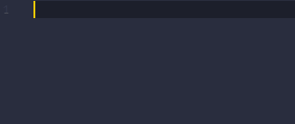

# HP-Chemstation GC/MS Macro Language

Language extension for Hewlet-Packard/Agilent's Chemstation Macro language for GC-GC/MS Systems. Provides syntax highlighting support and other features for all MSD Chemstation and Enviroquant versions up to 2010. 

## Features

### **Syntax Highlighting**
   
* Complete variable list (`reserved` and `system`)
* Complete function list
* Custom keyword highlighting rules for all commands
* Includes "Enhanced" and "Drug Analysis" variations


**Auto-Indentation** of `Name`, `If`, and `While` sections.




## Requirements
 
VSCode 1.42 or later

## Extension Settings

Includes file association for `.mac` filetypes.


## Recommendations

Token colors are determined by theme, while token name assignments are determined by scopes set by the language extension. The scope names were chosen to ultimately provide meaningful color contrast between statements, but sometimes a theme publisher will use the same color for multiple important tokens. For example, control keywords such as `if` and `while` could be the same color as support functions like `dim` and `open`. It is recommended to use a theme that differentiates between macros, functions, variables, and control keywords to make best use of syntax highlighting. 

For reference, the themes used in the previews are, respectively:
* [Material Theme](https://marketplace.visualstudio.com/items?itemName=Equinusocio.vsc-material-theme) by Mattia Astorino
* [Syntax](https://marketplace.visualstudio.com/items?itemName=XephAlpha.syntax) by XephAlpha
* [One Dark Pro](https://marketplace.visualstudio.com/items?itemName=zhuangtongfa.Material-theme) by binaryify

However, feel free to use any theme you like!

### **Formatting Special Variables**

Both `system` and `reserved` variables have their own unique scopes. It's possible to apply a global setting just for these tokens to allow them to stand out. 


Use `Ctrl+Shift+P` to open the Command Palette and search for `Preferences: Open Settings (JSON)`. Inside your `settings.json` file, add the following code:

``` JSON   
"editor.tokenColorCustomizations": {
    "textMateRules": [
        {
            "scope": "variable.other.reserved.chemmac",
            "settings": {
                "fontStyle": "bold"
            }
        },
        {
            "scope": "variable.other.system.chemmac",
            "settings": {
                "fontStyle": "bold"
            }
        }
    ]
}
```

Other font styles and foreground colors are also available. More information about customizing token styles can be found [here](https://code.visualstudio.com/docs/getstarted/themes#_editor-syntax-highlighting). 

## Known Issues

All entities declared following the `remove` command are given the `entity.name` token. It is impossible to distinguish between macros and variables in this statement line and therefore everything will be colored the same.

To submit bugs or issues please reach out through the Marketplace or through GitHub.
